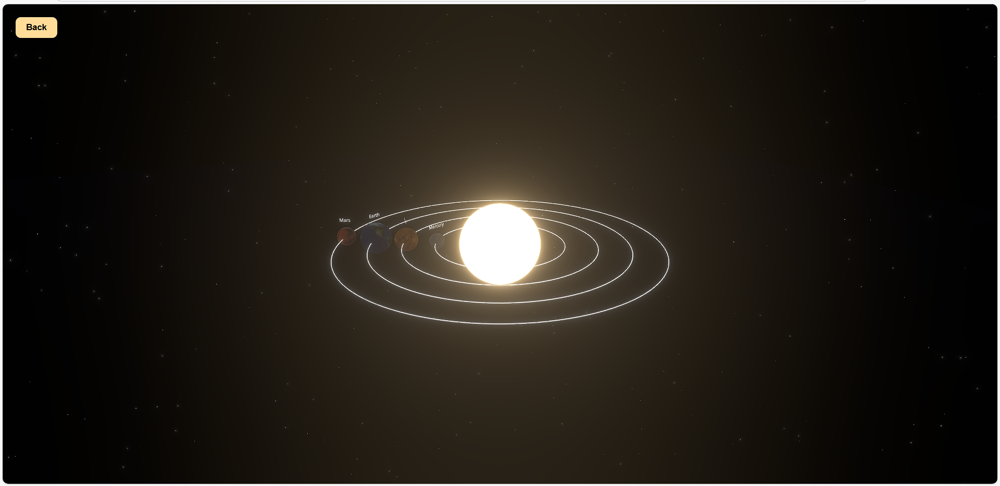

# 🌌 3D Solar System Visualization

A fully interactive **3D Solar System** built with **React**, **Three.js**, and **@react-three/fiber**.  
Click on planets to focus the camera, view information, and explore their circular orbits around the Sun.  

---

## 🚀 Features

- **Interactive Planets** – Click any planet to smoothly focus the camera on it.  
- **Circular Orbits** – Realistic circular orbits for Mercury, Venus, Earth, and Mars.  
- **Dynamic Labels** – Planet names displayed above each planet.  
- **Info Overlay** – Displays planet-specific information when selected.  
- **Sun** – Rotating sun with emissive texture and point light.  
- **Stars & Fog** – Background stars and subtle fog for depth perception.  
- **Postprocessing** – Bloom effect for cinematic lighting.  
- **Back Button** – Returns camera to free rotation around the Sun.  

---

## 🛠 Tech Stack

- **React** – Frontend framework  
- **Three.js** – 3D rendering engine  
- **@react-three/fiber** – React renderer for Three.js  
- **@react-three/drei** – Helpers like `Stars`, `Text`, `OrbitControls`  
- **Zustand** – State management for camera targeting  
- **Framer Motion** – Animations for overlay transitions  

---
## 📷 Screenshot

You can contribute and suggest more changes that will make it more unique.
